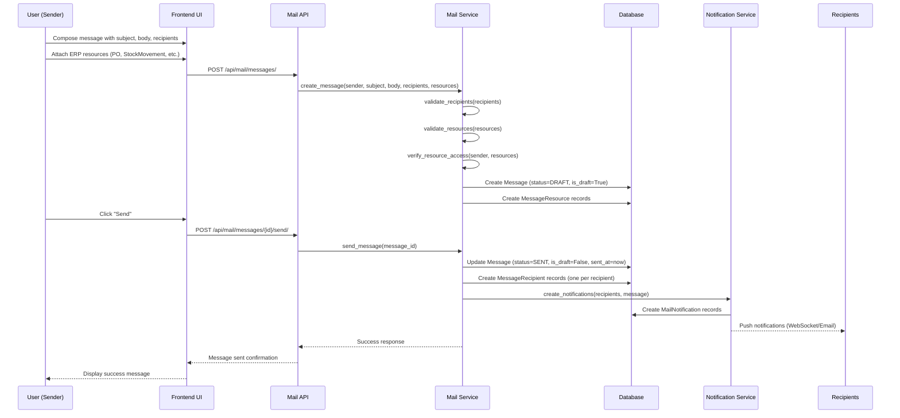

# Design Document: Internal Mail Service

## Overview

The Internal Mail Service is a cross-module communication system for the ERP that enables employees to exchange messages and share live ERP resources (warehouse items, purchase orders, production orders, etc.) within the organization. The key innovation is treating shared resources as interactive widgets rather than static links—when a user clicks on a shared resource, they are navigated directly to that resource in the ERP system. The mail service operates as an independent app that imports from other modules but is never imported by them, maintaining clean architectural boundaries. Messages are immutable once sent (drafts can be edited), and all recipient-specific state (read, archived, deleted) is stored per-recipient rather than on the message itself.

## Architecture

The mail service sits at the application layer, horizontally across all ERP modules. It has read-only awareness of resources from purchasing, production, inventory, sales, costing, finance, and accounting modules, but those modules have zero knowledge of the mail system.

```mermaid
graph TD
    subgraph "Mail App (backend/apps/mail/)"
        MailService[Mail Service Layer]
        MessageModel[Message Model]
        RecipientModel[MessageRecipient Model]
        ResourceModel[MessageResource Model]
        NotificationModel[MailNotification Model]
    end
    
    subgraph "ERP Modules"
        Purchasing[Purchasing Module]
        Production[Production Module]
        Inventory[Inventory Module]
        Sales[Sales Module]
        Costing[Costing Module]
        Finance[Finance Module]
        Accounting[Accounting Module]
    end
    
    subgraph "Shared Infrastructure"
        User[User Model]
        ContentType[Django ContentType]
    end
    
    MailService -->|imports from| Purchasing
    MailService -->|imports from| Production
    MailService -->|imports from| Inventory
    MailService -->|imports from| Sales
    MailService -->|imports from| Costing
    MailService -->|imports from| Finance
    MailService -->|imports from| Accounting
    
    ResourceModel -->|uses| ContentType
    MessageModel -->|references| User
    RecipientModel -->|references| User
    NotificationModel -->|references| User
    
    Purchasing -.->|no dependency| MailService
    Production -.->|no dependency| MailService
    Inventory -.->|no dependency| MailService
```



## Main Workflow: Sending a Message with Resources



## Components and Interfaces

### Component 1: Message Model

**Purpose**: Immutable core record representing a single communication. Once sent, the message body and subject cannot be modified.

**Interface**:
```python
class Message(models.Model):
    """
    Immutable core record representing a single communication.
    Drafts can be edited; sent messages cannot.
    """
    STATUS_CHOICES = [
        ('DRAFT', 'Draft'),
        ('SENT', 'Sent'),
        ('DELETED_BY_SENDER', 'Deleted by Sender'),
    ]
    
    id: UUID  # Primary key
    sender: ForeignKey[User]  # PROTECT - preserve audit trail
    subject: str  # max_length=255
    body: str  # TextField
    status: str  # CharField(choices=STATUS_CHOICES)
    parent_message: Optional[ForeignKey['Message']]  # SET_NULL for threading
    is_draft: bool  # default=True
    sent_at: Optional[datetime]  # nullable
    created_at: datetime  # auto_now_add
    updated_at: datetime  # auto_now
    
    # Methods
    def send() -> None:
        """Transition from draft to sent (one-way door)"""
    
    def can_edit() -> bool:
        """Returns True only if is_draft=True"""
    
    def get_recipients() -> QuerySet[User]:
        """Returns all recipients via MessageRecipient"""
    
    def get_resources() -> QuerySet[MessageResource]:
        """Returns all attached ERP resources"""
```

**Responsibilities**:
- Store immutable message content (subject, body)
- Track message lifecycle (draft → sent → deleted_by_sender)
- Support message threading via parent_message
- Enforce immutability after sending
- Maintain audit trail (sender, timestamps)

**Constraints**:
- Once `is_draft=False`, subject and body cannot be modified
- `sent_at` must be set when transitioning to SENT status
- `sender` uses PROTECT to preserve audit trail even if user is deleted
- `parent_message` uses SET_NULL to preserve thread structure

### Component 2: MessageRecipient Model

**Purpose**: Per-recipient state management. Each recipient gets their own independent state record for every message.

**Interface**:
```python
class MessageRecipient(models.Model):
    """
    Per-recipient state (one row per recipient per message).
    State belongs to the recipient, not the message.
    """
    RECIPIENT_TYPE_CHOICES = [
        ('TO', 'To'),
        ('CC', 'CC'),
        ('BCC', 'BCC'),
    ]
    
    id: UUID  # Primary key
    message: ForeignKey[Message]  # CASCADE
    recipient: ForeignKey[User]  # PROTECT
    recipient_type: str  # CharField(choices=RECIPIENT_TYPE_CHOICES)
    is_read: bool  # default=False
    read_at: Optional[datetime]  # nullable
    is_archived: bool  # default=False
    is_deleted: bool  # default=False (soft delete)
    deleted_at: Optional[datetime]  # nullable
    folder_label: Optional[str]  # max_length=50, nullable
    created_at: datetime  # auto_now_add
    
    # Methods
    def mark_as_read() -> None:
        """Set is_read=True and read_at=now()"""
    
    def mark_as_unread() -> None:
        """Set is_read=False and read_at=None"""
    
    def archive() -> None:
        """Set is_archived=True"""
    
    def unarchive() -> None:
        """Set is_archived=False"""
    
    def soft_delete() -> None:
        """Set is_deleted=True and deleted_at=now()"""
    
    def restore() -> None:
        """Set is_deleted=False and deleted_at=None"""
```

**Responsibilities**:
- Store per-recipient state independently
- Track read/unread status with timestamps
- Support archiving and soft deletion
- Enable custom folder organization
- Distinguish between TO, CC, BCC recipients

**Constraints**:
- Ten recipients = ten independent MessageRecipient records
- `message` uses CASCADE (if message deleted, recipient records deleted)
- `recipient` uses PROTECT (preserve records even if user deleted)
- `is_deleted` is a soft delete (data retained for audit)

### Component 3: MessageResource Model

**Purpose**: ERP linking layer that attaches live ERP records to messages. Uses Django's ContentType framework for polymorphic relationships.

**Interface**:
```python
class MessageResource(models.Model):
    """
    ERP linking layer (attaches live ERP records to messages).
    Uses Django ContentType for polymorphic relationships.
    """
    id: UUID  # Primary key
    message: ForeignKey[Message]  # CASCADE
    content_type: ForeignKey[ContentType]  # Django ContentType framework
    object_id: UUID  # UUIDField
    resource_label: str  # max_length=255, snapshot at send time
    resource_type_display: str  # max_length=100, e.g., "Purchase Order"
    attached_by: ForeignKey[User]  # PROTECT
    created_at: datetime  # auto_now_add
    access_verified_at: Optional[datetime]  # nullable
    
    # Generic relation
    content_object: GenericForeignKey  # Points to actual ERP resource
    
    # Methods
    def get_resource() -> Optional[Model]:
        """Returns the actual ERP resource object"""
    
    def verify_access(user: User) -> bool:
        """Check if user has permission to view this resource"""
    
    def get_resource_url() -> str:
        """Generate frontend URL for this resource"""
    
    def refresh_label() -> None:
        """Update resource_label from current resource state"""
```

**Responsibilities**:
- Link messages to any ERP resource type
- Store resource metadata snapshot (label, type)
- Track who attached the resource
- Support access verification
- Generate navigation URLs for frontend

**Constraints**:
- Uses Django ContentType + GenericForeignKey for polymorphism
- `resource_label` is a snapshot taken at send time (immutable)
- `content_type` + `object_id` must point to valid ERP resource
- Only whitelisted resource types can be attached

### Component 4: MailNotification Model

**Purpose**: Delivery awareness system for notifying recipients of new messages, replies, and mentions.

**Interface**:
```python
class MailNotification(models.Model):
    """
    Delivery awareness - notifies recipients of new messages.
    """
    NOTIFICATION_TYPE_CHOICES = [
        ('NEW_MESSAGE', 'New Message'),
        ('NEW_REPLY', 'New Reply'),
        ('MENTIONED', 'Mentioned'),
    ]
    
    id: UUID  # Primary key
    recipient: ForeignKey[User]  # CASCADE
    message: ForeignKey[Message]  # CASCADE
    notification_type: str  # CharField(choices=NOTIFICATION_TYPE_CHOICES)
    is_dismissed: bool  # default=False
    created_at: datetime  # auto_now_add
    
    # Methods
    def dismiss() -> None:
        """Mark notification as dismissed"""
    
    def get_notification_text() -> str:
        """Generate human-readable notification text"""
```

**Responsibilities**:
- Create notifications for message events
- Track notification dismissal state
- Support different notification types
- Enable real-time delivery awareness

**Constraints**:
- One notification per recipient per message event
- `recipient` and `message` use CASCADE (cleanup when deleted)
- Notifications are separate from MessageRecipient state

### Component 5: Mail Service Layer

**Purpose**: Business logic orchestration for message operations, resource attachment, and notification delivery.

**Interface**:
```python
class MailService:
    """
    Service layer for mail operations.
    Orchestrates message creation, sending, and resource attachment.
    """
    
    @staticmethod
    def create_draft(
        sender: User,
        subject: str,
        body: str,
        recipients: List[Dict[str, Any]],
        resources: Optional[List[Dict[str, Any]]] = None,
        parent_message: Optional[Message] = None
    ) -> Message:
        """Create a draft message with optional resources"""
    
    @staticmethod
    def send_message(message: Message) -> None:
        """
        Transition message from draft to sent.
        Creates MessageRecipient records and notifications.
        """
    
    @staticmethod
    def attach_resource(
        message: Message,
        resource_type: str,
        resource_id: UUID,
        attached_by: User
    ) -> MessageResource:
        """Attach an ERP resource to a message"""
    
    @staticmethod
    def validate_resource_access(
        user: User,
        resource_type: str,
        resource_id: UUID
    ) -> bool:
        """Verify user has permission to attach/view resource"""
    
    @staticmethod
    def get_inbox(user: User, filters: Dict[str, Any]) -> QuerySet[MessageRecipient]:
        """Get user's inbox with filtering"""
    
    @staticmethod
    def get_sent_messages(user: User) -> QuerySet[Message]:
        """Get messages sent by user"""
    
    @staticmethod
    def mark_as_read(recipient_record: MessageRecipient) -> None:
        """Mark message as read for specific recipient"""
    
    @staticmethod
    def reply_to_message(
        original_message: Message,
        sender: User,
        body: str,
        recipients: List[Dict[str, Any]]
    ) -> Message:
        """Create a reply to an existing message"""
```

**Responsibilities**:
- Orchestrate message lifecycle (draft → sent)
- Validate resource attachments and access permissions
- Create MessageRecipient records on send
- Trigger notification creation
- Provide inbox and sent message queries
- Handle message threading (replies)

**Constraints**:
- Only draft messages can be sent
- Resource types must be in whitelist
- Sender must have access to attached resources
- Recipients must be valid active users

## Data Models

### Model 1: Message (Expanded)

```python
from django.db import models
from django.conf import settings
import uuid

class Message(models.Model):
    """
    Immutable core record representing a single communication.
    Once sent, the message cannot be edited.
    """
    STATUS_CHOICES = [
        ('DRAFT', 'Draft'),
        ('SENT', 'Sent'),
        ('DELETED_BY_SENDER', 'Deleted by Sender'),
    ]
    
    id = models.UUIDField(primary_key=True, default=uuid.uuid4, editable=False)
    sender = models.ForeignKey(
        settings.AUTH_USER_MODEL,
        on_delete=models.PROTECT,
        related_name='sent_messages'
    )
    subject = models.CharField(max_length=255)
    body = models.TextField()
    status = models.CharField(max_length=20, choices=STATUS_CHOICES, default='DRAFT')
    parent_message = models.ForeignKey(
        'self',
        on_delete=models.SET_NULL,
        null=True,
        blank=True,
        related_name='replies'
    )
    is_draft = models.BooleanField(default=True)
    sent_at = models.DateTimeField(null=True, blank=True)
    created_at = models.DateTimeField(auto_now_add=True)
    updated_at = models.DateTimeField(auto_now=True)
    
    class Meta:
        verbose_name = 'Message'
        verbose_name_plural = 'Messages'
        ordering = ['-created_at']
        indexes = [
            models.Index(fields=['sender', 'status'], name='msg_sender_status_idx'),
            models.Index(fields=['parent_message'], name='msg_parent_idx'),
            models.Index(fields=['sent_at'], name='msg_sent_at_idx'),
        ]
    
    def __str__(self):
        return f"{self.subject} (from {self.sender.username})"
```

**Validation Rules**:
- `subject` must not be empty
- `body` must not be empty
- `sent_at` must be set when `status='SENT'`
- `is_draft` must be False when `status='SENT'`
- Once `is_draft=False`, subject and body are immutable

### Model 2: MessageRecipient (Expanded)

```python
class MessageRecipient(models.Model):
    """
    Per-recipient state (one row per recipient per message).
    State belongs to the recipient, not the message.
    """
    RECIPIENT_TYPE_CHOICES = [
        ('TO', 'To'),
        ('CC', 'CC'),
        ('BCC', 'BCC'),
    ]
    
    id = models.UUIDField(primary_key=True, default=uuid.uuid4, editable=False)
    message = models.ForeignKey(
        Message,
        on_delete=models.CASCADE,
        related_name='recipients'
    )
    recipient = models.ForeignKey(
        settings.AUTH_USER_MODEL,
        on_delete=models.PROTECT,
        related_name='received_messages'
    )
    recipient_type = models.CharField(max_length=3, choices=RECIPIENT_TYPE_CHOICES, default='TO')
    is_read = models.BooleanField(default=False)
    read_at = models.DateTimeField(null=True, blank=True)
    is_archived = models.BooleanField(default=False)
    is_deleted = models.BooleanField(default=False)
    deleted_at = models.DateTimeField(null=True, blank=True)
    folder_label = models.CharField(max_length=50, null=True, blank=True)
    created_at = models.DateTimeField(auto_now_add=True)
    
    class Meta:
        verbose_name = 'Message Recipient'
        verbose_name_plural = 'Message Recipients'
        unique_together = ('message', 'recipient')
        indexes = [
            models.Index(fields=['recipient', 'is_read'], name='msgrecip_user_read_idx'),
            models.Index(fields=['recipient', 'is_deleted'], name='msgrecip_user_deleted_idx'),
            models.Index(fields=['recipient', 'is_archived'], name='msgrecip_user_archived_idx'),
        ]
    
    def __str__(self):
        return f"{self.message.subject} → {self.recipient.username}"
```

**Validation Rules**:
- `message` and `recipient` combination must be unique
- `read_at` must be set when `is_read=True`
- `deleted_at` must be set when `is_deleted=True`
- `folder_label` must be alphanumeric with hyphens/underscores only

### Model 3: MessageResource (Expanded)

```python
from django.contrib.contenttypes.fields import GenericForeignKey
from django.contrib.contenttypes.models import ContentType

class MessageResource(models.Model):
    """
    ERP linking layer (attaches live ERP records to messages).
    Uses Django ContentType for polymorphic relationships.
    """
    id = models.UUIDField(primary_key=True, default=uuid.uuid4, editable=False)
    message = models.ForeignKey(
        Message,
        on_delete=models.CASCADE,
        related_name='resources'
    )
    content_type = models.ForeignKey(ContentType, on_delete=models.PROTECT)
    object_id = models.UUIDField()
    content_object = GenericForeignKey('content_type', 'object_id')
    
    resource_label = models.CharField(max_length=255)
    resource_type_display = models.CharField(max_length=100)
    attached_by = models.ForeignKey(
        settings.AUTH_USER_MODEL,
        on_delete=models.PROTECT,
        related_name='attached_resources'
    )
    created_at = models.DateTimeField(auto_now_add=True)
    access_verified_at = models.DateTimeField(null=True, blank=True)
    
    class Meta:
        verbose_name = 'Message Resource'
        verbose_name_plural = 'Message Resources'
        indexes = [
            models.Index(fields=['message'], name='msgres_message_idx'),
            models.Index(fields=['content_type', 'object_id'], name='msgres_content_idx'),
        ]
    
    def __str__(self):
        return f"{self.resource_type_display}: {self.resource_label}"
```

**Validation Rules**:
- `content_type` must be in the shareable resources whitelist
- `object_id` must point to an existing resource
- `resource_label` is captured at attachment time (immutable)
- `attached_by` must have access to the resource

### Model 4: MailNotification (Expanded)

```python
class MailNotification(models.Model):
    """
    Delivery awareness - notifies recipients of new messages.
    """
    NOTIFICATION_TYPE_CHOICES = [
        ('NEW_MESSAGE', 'New Message'),
        ('NEW_REPLY', 'New Reply'),
        ('MENTIONED', 'Mentioned'),
    ]
    
    id = models.UUIDField(primary_key=True, default=uuid.uuid4, editable=False)
    recipient = models.ForeignKey(
        settings.AUTH_USER_MODEL,
        on_delete=models.CASCADE,
        related_name='mail_notifications'
    )
    message = models.ForeignKey(
        Message,
        on_delete=models.CASCADE,
        related_name='notifications'
    )
    notification_type = models.CharField(max_length=20, choices=NOTIFICATION_TYPE_CHOICES)
    is_dismissed = models.BooleanField(default=False)
    created_at = models.DateTimeField(auto_now_add=True)
    
    class Meta:
        verbose_name = 'Mail Notification'
        verbose_name_plural = 'Mail Notifications'
        ordering = ['-created_at']
        indexes = [
            models.Index(fields=['recipient', 'is_dismissed'], name='notif_user_dismissed_idx'),
            models.Index(fields=['created_at'], name='notif_created_at_idx'),
        ]
    
    def __str__(self):
        return f"{self.notification_type} for {self.recipient.username}"
```

**Validation Rules**:
- One notification per recipient per message event
- `notification_type` must match the event that triggered it
- Notifications are independent of MessageRecipient state

## Shareable ERP Resources Whitelist (Expanded)

The mail service supports attaching the following ERP resource types. This list is maintained as a service-layer constant and can be extended as new modules are added.

### Purchasing Module Resources

| Resource Type | Model | Description | Key Fields for Label |
|--------------|-------|-------------|---------------------|
| PurchaseRequisition | `purchasing.PurchaseRequisition` | Internal purchase request | `pr_number`, `title`, `status` |
| PurchaseOrder | `purchasing.PurchaseOrder` | Formal supplier order | `po_number`, `supplier.name`, `status` |
| GoodsReceipt | `purchasing.GoodsReceipt` | Received goods record | `gr_number`, `purchase_order.po_number`, `status` |
| SupplierInvoice | `purchasing.SupplierInvoice` | Supplier billing document | `invoice_number`, `supplier.name`, `total_amount` |
| Supplier | `purchasing.Supplier` | Supplier master record | `name`, `supplier_type` |
| SupplierProduct | `purchasing.SupplierProduct` | Supplier-product pricing | `supplier.name`, `product.name`, `price` |

### Production Module Resources

| Resource Type | Model | Description | Key Fields for Label |
|--------------|-------|-------------|---------------------|
| ProductionOrder | `production.ProductionOrder` | Production schedule | `id`, `product.name`, `quantity`, `status` |
| ProductionBatch | `production.ProductionBatch` | Individual production batch | `batch_number`, `product.name`, `status` |
| ReworkOrder | `production.ReworkOrder` | Rework/correction order | `id`, `target_product.name`, `status` |

### Inventory Module Resources

| Resource Type | Model | Description | Key Fields for Label |
|--------------|-------|-------------|---------------------|
| StockMovement | `inventory.StockMovement` | Stock transaction audit | `id`, `movement_type`, `total_quantity`, `warehouse.name` |
| Stock | `inventory.Stock` | Current inventory level | `product.name`, `warehouse.name`, `quantity_on_hand` |
| Batch | `inventory.Batch` | Product lot/batch | `batch_number`, `product.name`, `quantity` |
| ProductPolicy | `inventory.ProductPolicy` | Reorder policy | `product.name`, `warehouse.name`, `min_stock_level` |
| InventoryAlert | `inventory.InventoryAlert` | Stock alert | `alert_type`, `product.name`, `status` |

### Sales Module Resources

| Resource Type | Model | Description | Key Fields for Label |
|--------------|-------|-------------|---------------------|
| SalesOrder | `sales.SalesOrder` | Customer order | `order_number`, `customer.name`, `status` |
| Delivery | `sales.Delivery` | Delivery record | `delivery_number`, `sales_order.order_number`, `status` |
| Invoice | `sales.Invoice` | Customer invoice | `invoice_number`, `sales_order.order_number`, `total_amount` |
| Payment | `sales.Payment` | Customer payment | `id`, `invoice.invoice_number`, `amount` |
| Customer | `sales.Customer` | Customer master record | `name`, `customer_type` |

### Costing Module Resources

| Resource Type | Model | Description | Key Fields for Label |
|--------------|-------|-------------|---------------------|
| CostingEntry | `costing.CostingEntry` | Actual production cost | `production_batch.batch_number`, `cost_per_unit` |
| StandardCost | `costing.StandardCost` | Theoretical cost benchmark | `product.name`, `total_standard_cost_per_unit` |
| CostVarianceRecord | `costing.CostVarianceRecord` | Cost variance analysis | `product.name`, `total_variance`, `is_favourable` |
| OverheadRate | `costing.OverheadRate` | Overhead allocation rate | `warehouse.name`, `rate_per_unit` |
| ProductPricingRule | `costing.ProductPricingRule` | Pricing strategy | `product.name`, `recommended_selling_price` |

### Finance Module Resources

| Resource Type | Model | Description | Key Fields for Label |
|--------------|-------|-------------|---------------------|
| AccountsReceivable | `finance.AccountsReceivable` | Customer debt tracking | `customer.name`, `invoice.invoice_number`, `amount_outstanding` |
| AccountsPayable | `finance.AccountsPayable` | Supplier debt tracking | `supplier.name`, `supplier_invoice.invoice_number`, `amount_outstanding` |
| SupplierPayment | `finance.SupplierPayment` | Payment to supplier | `accounts_payable.supplier.name`, `amount`, `payment_date` |

### Accounting Module Resources

| Resource Type | Model | Description | Key Fields for Label |
|--------------|-------|-------------|---------------------|
| JournalEntry | `accounting.JournalEntry` | Accounting journal entry | `entry_number`, `entry_type`, `total_debit` |

### Central Module Resources

| Resource Type | Model | Description | Key Fields for Label |
|--------------|-------|-------------|---------------------|
| Product | `central.Product` | Product master record | `name`, `sku`, `product_type` |
| Warehouse | `central.Warehouse` | Warehouse/facility | `name`, `warehouse_type` |

**Total Shareable Resource Types**: 32

**Implementation Note**: The whitelist is implemented as a Python constant in `backend/apps/mail/constants.py`:

```python
SHAREABLE_RESOURCES = {
    'purchasing.PurchaseRequisition': {
        'model': 'purchasing.PurchaseRequisition',
        'label_fields': ['pr_number', 'title', 'status'],
        'display_name': 'Purchase Requisition',
    },
    'purchasing.PurchaseOrder': {
        'model': 'purchasing.PurchaseOrder',
        'label_fields': ['po_number', 'supplier__name', 'status'],
        'display_name': 'Purchase Order',
    },
    # ... (all 32 resource types)
}
```

## Algorithmic Pseudocode

### Main Processing Algorithm: Send Message

```python
def send_message(message_id: UUID) -> Result:
    """
    Transition a draft message to sent status.
    Creates recipient records and notifications.
    
    Preconditions:
        - message exists and is in DRAFT status
        - message.is_draft == True
        - message has at least one recipient specified
        - all attached resources are valid and accessible
    
    Postconditions:
        - message.status == 'SENT'
        - message.is_draft == False
        - message.sent_at is set to current timestamp
        - MessageRecipient records created for all recipients
        - MailNotification records created for all recipients
        - message content is now immutable
    
    Loop Invariants:
        - All processed recipients have valid MessageRecipient records
        - All processed recipients have valid MailNotification records
        - Message state remains consistent throughout
    """
    
    # Step 1: Validate message state
    message = Message.objects.get(id=message_id)
    
    if not message.is_draft:
        raise ValidationError("Cannot send non-draft message")
    
    if message.status != 'DRAFT':
        raise ValidationError("Message must be in DRAFT status")
    
    # Step 2: Get recipients from temporary storage or parameter
    recipients = get_pending_recipients(message)
    
    if not recipients:
        raise ValidationError("Message must have at least one recipient")
    
    # Step 3: Validate all recipients
    for recipient_data in recipients:
        user = User.objects.get(id=recipient_data['user_id'])
        if not user.is_active:
            raise ValidationError(f"Recipient {user.username} is not active")
    
    # Step 4: Validate all attached resources
    resources = MessageResource.objects.filter(message=message)
    for resource in resources:
        if not resource.content_object:
            raise ValidationError(f"Resource {resource.id} points to non-existent object")
        
        if not verify_resource_access(message.sender, resource):
            raise ValidationError(f"Sender lacks access to resource {resource.id}")
    
    # Step 5: Begin atomic transaction
    with transaction.atomic():
        # Update message status
        message.status = 'SENT'
        message.is_draft = False
        message.sent_at = timezone.now()
        message.save()
        
        # Create MessageRecipient records
        recipient_records = []
        for recipient_data in recipients:
            recipient_record = MessageRecipient.objects.create(
                message=message,
                recipient_id=recipient_data['user_id'],
                recipient_type=recipient_data.get('type', 'TO')
            )
            recipient_records.append(recipient_record)
        
        # Create MailNotification records
        notification_type = 'NEW_REPLY' if message.parent_message else 'NEW_MESSAGE'
        for recipient_record in recipient_records:
            MailNotification.objects.create(
                recipient=recipient_record.recipient,
                message=message,
                notification_type=notification_type
            )
    
    # Step 6: Trigger real-time notifications (async)
    send_realtime_notifications.delay(message.id)
    
    return Result(success=True, message=message)
```

### Validation Algorithm: Resource Access

```python
def verify_resource_access(user: User, resource: MessageResource) -> bool:
    """
    Verify that a user has permission to view/attach a resource.
    
    Preconditions:
        - user is a valid User instance
        - resource is a valid MessageResource instance
        - resource.content_object exists
    
    Postconditions:
        - Returns True if user has access, False otherwise
        - No side effects on user or resource
        - Access check is logged for audit
    
    Loop Invariants: N/A (no loops)
    """
    
    # Step 1: Get the actual resource object
    resource_obj = resource.content_object
    
    if not resource_obj:
        return False
    
    # Step 2: Check resource type whitelist
    content_type_key = f"{resource.content_type.app_label}.{resource.content_type.model}"
    
    if content_type_key not in SHAREABLE_RESOURCES:
        return False
    
    # Step 3: Apply resource-specific access rules
    # Different resource types have different access patterns
    
    if isinstance(resource_obj, PurchaseOrder):
        # User must be in purchasing role or be the creator
        return (
            user.role in ['purchasing_officer', 'manager', 'owner_director', 'system_admin']
            or resource_obj.created_by == user
        )
    
    elif isinstance(resource_obj, ProductionOrder):
        # User must be in production role or warehouse matches
        return (
            user.role in ['production_operator', 'production_supervisor', 'manager', 'owner_director', 'system_admin']
            or resource_obj.warehouse in user.accessible_warehouses.all()
        )
    
    elif isinstance(resource_obj, StockMovement):
        # User must have inventory access to the warehouse
        return (
            user.role in ['warehouse_staff', 'inventory_controller', 'manager', 'owner_director', 'system_admin']
            or resource_obj.warehouse in user.accessible_warehouses.all()
        )
    
    elif isinstance(resource_obj, Invoice):
        # User must be in sales/accounting or be the creator
        return (
            user.role in ['sales_rep', 'accountant', 'manager', 'owner_director', 'system_admin']
            or resource_obj.created_by == user
        )
    
    # Default: managers and admins can access everything
    return user.role in ['manager', 'owner_director', 'system_admin']
```

### Query Algorithm: Get User Inbox

```python
def get_inbox(user: User, filters: Dict[str, Any]) -> QuerySet[MessageRecipient]:
    """
    Retrieve user's inbox with optional filtering.
    
    Preconditions:
        - user is a valid User instance
        - filters is a dictionary with optional keys: is_read, is_archived, folder_label, search_query
    
    Postconditions:
        - Returns QuerySet of MessageRecipient records
        - Results are ordered by message.sent_at descending
        - Only non-deleted messages are included
        - Results respect all filter parameters
    
    Loop Invariants:
        - All returned records belong to the specified user
        - All returned records are not soft-deleted
        - Filter conditions are applied cumulatively
    """
    
    # Step 1: Base query - user's received messages, not deleted
    queryset = MessageRecipient.objects.filter(
        recipient=user,
        is_deleted=False
    ).select_related(
        'message',
        'message__sender'
    ).prefetch_related(
        'message__resources'
    )
    
    # Step 2: Apply filters cumulatively
    if 'is_read' in filters:
        queryset = queryset.filter(is_read=filters['is_read'])
    
    if 'is_archived' in filters:
        queryset = queryset.filter(is_archived=filters['is_archived'])
    
    if 'folder_label' in filters:
        queryset = queryset.filter(folder_label=filters['folder_label'])
    
    if 'search_query' in filters:
        search_query = filters['search_query']
        queryset = queryset.filter(
            Q(message__subject__icontains=search_query) |
            Q(message__body__icontains=search_query) |
            Q(message__sender__username__icontains=search_query)
        )
    
    # Step 3: Order by sent date descending
    queryset = queryset.order_by('-message__sent_at')
    
    return queryset
```

### Resource Attachment Algorithm

```python
def attach_resource(
    message: Message,
    resource_type: str,
    resource_id: UUID,
    attached_by: User
) -> MessageResource:
    """
    Attach an ERP resource to a message.
    
    Preconditions:
        - message is in DRAFT status
        - resource_type is in SHAREABLE_RESOURCES whitelist
        - resource with resource_id exists
        - attached_by has access to the resource
    
    Postconditions:
        - MessageResource record created and linked to message
        - resource_label captured from current resource state
        - resource_type_display set to human-readable name
        - Returns the created MessageResource instance
    
    Loop Invariants: N/A (no loops)
    """
    
    # Step 1: Validate message state
    if not message.is_draft:
        raise ValidationError("Cannot attach resources to sent messages")
    
    # Step 2: Validate resource type
    if resource_type not in SHAREABLE_RESOURCES:
        raise ValidationError(f"Resource type {resource_type} is not shareable")
    
    # Step 3: Get resource configuration
    resource_config = SHAREABLE_RESOURCES[resource_type]
    model_class = apps.get_model(resource_config['model'])
    
    # Step 4: Fetch the resource object
    try:
        resource_obj = model_class.objects.get(id=resource_id)
    except model_class.DoesNotExist:
        raise ValidationError(f"Resource {resource_id} not found")
    
    # Step 5: Verify access
    if not verify_resource_access(attached_by, resource_obj):
        raise PermissionError(f"User lacks access to resource {resource_id}")
    
    # Step 6: Generate resource label
    label_fields = resource_config['label_fields']
    label_parts = []
    for field in label_fields:
        value = get_nested_attr(resource_obj, field)
        if value:
            label_parts.append(str(value))
    resource_label = ' - '.join(label_parts)
    
    # Step 7: Create MessageResource record
    content_type = ContentType.objects.get_for_model(model_class)
    message_resource = MessageResource.objects.create(
        message=message,
        content_type=content_type,
        object_id=resource_id,
        resource_label=resource_label,
        resource_type_display=resource_config['display_name'],
        attached_by=attached_by,
        access_verified_at=timezone.now()
    )
    
    return message_resource
```

## Key Functions with Formal Specifications

### Function 1: create_draft()

```python
def create_draft(
    sender: User,
    subject: str,
    body: str,
    recipients: List[Dict[str, Any]],
    resources: Optional[List[Dict[str, Any]]] = None,
    parent_message: Optional[Message] = None
) -> Message:
    """Create a draft message with optional resources and threading."""
```

**Preconditions:**
- `sender` is a valid, active User instance
- `subject` is non-empty string (max 255 characters)
- `body` is non-empty string
- `recipients` is a non-empty list of dicts with 'user_id' and optional 'type' keys
- All recipient user_ids reference valid, active users
- If `resources` provided, all resource types are in whitelist
- If `parent_message` provided, it exists and sender has access to it

**Postconditions:**
- Returns a Message instance with status='DRAFT' and is_draft=True
- Message is persisted to database
- If resources provided, MessageResource records are created
- sent_at is None
- Message can be edited until sent

**Loop Invariants:**
- For resource attachment loop: All previously attached resources are valid and accessible

### Function 2: mark_as_read()

```python
def mark_as_read(recipient_record: MessageRecipient) -> None:
    """Mark a message as read for a specific recipient."""
```

**Preconditions:**
- `recipient_record` is a valid MessageRecipient instance
- `recipient_record` exists in database

**Postconditions:**
- `recipient_record.is_read` is True
- `recipient_record.read_at` is set to current timestamp
- Changes are persisted to database
- No side effects on other recipients' states

**Loop Invariants:** N/A (no loops)

### Function 3: reply_to_message()

```python
def reply_to_message(
    original_message: Message,
    sender: User,
    body: str,
    recipients: List[Dict[str, Any]]
) -> Message:
    """Create a reply to an existing message."""
```

**Preconditions:**
- `original_message` is a valid Message instance with status='SENT'
- `sender` is a valid, active User instance
- `sender` is either the original sender or a recipient of original_message
- `body` is non-empty string
- `recipients` is a non-empty list

**Postconditions:**
- Returns a new Message instance with parent_message=original_message
- New message is in DRAFT status
- Subject is prefixed with "Re: " if not already present
- Original message's reply count is incremented
- Reply is linked via parent_message foreign key

**Loop Invariants:** N/A (no loops)

### Function 4: soft_delete_message()

```python
def soft_delete_message(recipient_record: MessageRecipient) -> None:
    """Soft delete a message for a specific recipient."""
```

**Preconditions:**
- `recipient_record` is a valid MessageRecipient instance
- `recipient_record.is_deleted` is False

**Postconditions:**
- `recipient_record.is_deleted` is True
- `recipient_record.deleted_at` is set to current timestamp
- Message remains in database (soft delete)
- Other recipients' states are unaffected
- Message can be restored later

**Loop Invariants:** N/A (no loops)

### Function 5: get_resource_url()

```python
def get_resource_url(resource: MessageResource) -> str:
    """Generate frontend navigation URL for a resource."""
```

**Preconditions:**
- `resource` is a valid MessageResource instance
- `resource.content_object` exists
- `resource.content_type` is in SHAREABLE_RESOURCES whitelist

**Postconditions:**
- Returns a valid frontend URL string
- URL format: `/app/{module}/{resource_type}/{resource_id}`
- URL is navigable in the frontend application
- No side effects on resource

**Loop Invariants:** N/A (no loops)

## Example Usage

### Example 1: Creating and Sending a Message with Resources

```python
from apps.mail.services import MailService
from apps.accounts.models import User
from apps.purchasing.models import PurchaseOrder

# Get users
sender = User.objects.get(username='john.doe')
recipient1 = User.objects.get(username='jane.smith')
recipient2 = User.objects.get(username='bob.jones')

# Get a purchase order to attach
po = PurchaseOrder.objects.get(po_number='PO-2024-001')

# Create draft message
message = MailService.create_draft(
    sender=sender,
    subject='Review Purchase Order PO-2024-001',
    body='Please review the attached purchase order and approve if everything looks correct.',
    recipients=[
        {'user_id': recipient1.id, 'type': 'TO'},
        {'user_id': recipient2.id, 'type': 'CC'},
    ],
    resources=[
        {'resource_type': 'purchasing.PurchaseOrder', 'resource_id': po.id}
    ]
)

# Edit draft if needed
message.body += '\n\nUrgent: Need approval by EOD.'
message.save()

# Send message
MailService.send_message(message)

# Result: Message sent, recipients notified, PO attached as interactive widget
```

### Example 2: Reading Inbox and Marking as Read

```python
from apps.mail.services import MailService

# Get user's unread messages
user = User.objects.get(username='jane.smith')
unread_messages = MailService.get_inbox(
    user=user,
    filters={'is_read': False}
)

# Display inbox
for recipient_record in unread_messages:
    message = recipient_record.message
    print(f"From: {message.sender.username}")
    print(f"Subject: {message.subject}")
    print(f"Sent: {message.sent_at}")
    
    # Show attached resources
    for resource in message.resources.all():
        print(f"  Attached: {resource.resource_type_display} - {resource.resource_label}")
    
    # Mark as read
    MailService.mark_as_read(recipient_record)
```

### Example 3: Replying to a Message

```python
from apps.mail.services import MailService

# Get original message
original_message = Message.objects.get(id='some-uuid')

# Create reply
reply = MailService.reply_to_message(
    original_message=original_message,
    sender=user,
    body='Approved. Please proceed with the order.',
    recipients=[
        {'user_id': original_message.sender.id, 'type': 'TO'}
    ]
)

# Send reply
MailService.send_message(reply)

# Result: Reply sent, linked to original via parent_message
```

### Example 4: Searching Messages

```python
from apps.mail.services import MailService

# Search for messages containing "purchase order"
search_results = MailService.get_inbox(
    user=user,
    filters={'search_query': 'purchase order'}
)

# Search results include messages with matching subject, body, or sender
for recipient_record in search_results:
    print(f"Found: {recipient_record.message.subject}")
```

### Example 5: Archiving and Organizing Messages

```python
# Archive a message
recipient_record = MessageRecipient.objects.get(
    message_id='some-uuid',
    recipient=user
)
recipient_record.is_archived = True
recipient_record.save()

# Organize into custom folder
recipient_record.folder_label = 'urgent'
recipient_record.save()

# Get messages from specific folder
urgent_messages = MailService.get_inbox(
    user=user,
    filters={'folder_label': 'urgent'}
)
```

### Example 6: Accessing Attached Resources

```python
# Get a message with resources
message = Message.objects.get(id='some-uuid')

# Iterate through attached resources
for resource in message.resources.all():
    # Get the actual ERP object
    erp_object = resource.content_object
    
    # Generate navigation URL
    url = MailService.get_resource_url(resource)
    
    # Check if current user has access
    if MailService.verify_resource_access(current_user, resource):
        print(f"Navigate to: {url}")
        print(f"Resource: {erp_object}")
    else:
        print("Access denied to this resource")
```

## API Endpoint Design

### Message Endpoints

| Method | Endpoint | Description | Request Body | Response |
|--------|----------|-------------|--------------|----------|
| POST | `/api/mail/messages/` | Create draft message | `{sender, subject, body, recipients, resources}` | Message object |
| GET | `/api/mail/messages/` | List user's sent messages | Query params: `?status=SENT` | Paginated message list |
| GET | `/api/mail/messages/{id}/` | Get message details | - | Message object with resources |
| PATCH | `/api/mail/messages/{id}/` | Update draft message | `{subject?, body?}` | Updated message object |
| POST | `/api/mail/messages/{id}/send/` | Send draft message | - | Success response |
| DELETE | `/api/mail/messages/{id}/` | Delete draft (sender) | - | 204 No Content |

### Inbox Endpoints

| Method | Endpoint | Description | Request Body | Response |
|--------|----------|-------------|--------------|----------|
| GET | `/api/mail/inbox/` | Get user's inbox | Query params: `?is_read=false&is_archived=false&search=query` | Paginated recipient records |
| GET | `/api/mail/inbox/{id}/` | Get specific inbox item | - | MessageRecipient object |
| PATCH | `/api/mail/inbox/{id}/` | Update recipient state | `{is_read?, is_archived?, folder_label?}` | Updated recipient record |
| DELETE | `/api/mail/inbox/{id}/` | Soft delete message | - | 204 No Content |
| POST | `/api/mail/inbox/{id}/restore/` | Restore deleted message | - | Restored recipient record |

### Resource Endpoints

| Method | Endpoint | Description | Request Body | Response |
|--------|----------|-------------|--------------|----------|
| POST | `/api/mail/messages/{id}/resources/` | Attach resource to draft | `{resource_type, resource_id}` | MessageResource object |
| GET | `/api/mail/messages/{id}/resources/` | List message resources | - | List of MessageResource objects |
| DELETE | `/api/mail/messages/{id}/resources/{resource_id}/` | Remove resource from draft | - | 204 No Content |
| GET | `/api/mail/resources/{id}/url/` | Get resource navigation URL | - | `{url: string}` |

### Notification Endpoints

| Method | Endpoint | Description | Request Body | Response |
|--------|----------|-------------|--------------|----------|
| GET | `/api/mail/notifications/` | Get user's notifications | Query params: `?is_dismissed=false` | Paginated notification list |
| PATCH | `/api/mail/notifications/{id}/dismiss/` | Dismiss notification | - | Updated notification |
| POST | `/api/mail/notifications/dismiss-all/` | Dismiss all notifications | - | Success response |

### Reply Endpoints

| Method | Endpoint | Description | Request Body | Response |
|--------|----------|-------------|--------------|----------|
| POST | `/api/mail/messages/{id}/reply/` | Create reply to message | `{body, recipients}` | New message object (draft) |
| GET | `/api/mail/messages/{id}/thread/` | Get message thread | - | List of messages in thread |

## Error Handling

### Error Scenario 1: Sending Non-Draft Message

**Condition**: User attempts to send a message that is not in DRAFT status
**Response**: HTTP 400 Bad Request
```json
{
  "error": "validation_error",
  "message": "Cannot send non-draft message",
  "code": "MESSAGE_NOT_DRAFT"
}
```
**Recovery**: User must create a new draft message

### Error Scenario 2: Attaching Invalid Resource

**Condition**: User attempts to attach a resource type not in whitelist
**Response**: HTTP 400 Bad Request
```json
{
  "error": "validation_error",
  "message": "Resource type 'invalid.Model' is not shareable",
  "code": "INVALID_RESOURCE_TYPE"
}
```
**Recovery**: User must select a valid resource type from the whitelist

### Error Scenario 3: Insufficient Resource Access

**Condition**: User attempts to attach a resource they don't have permission to view
**Response**: HTTP 403 Forbidden
```json
{
  "error": "permission_denied",
  "message": "You do not have access to this resource",
  "code": "RESOURCE_ACCESS_DENIED"
}
```
**Recovery**: User must request access or select a different resource

### Error Scenario 4: Recipient Not Found

**Condition**: User attempts to send message to non-existent or inactive user
**Response**: HTTP 400 Bad Request
```json
{
  "error": "validation_error",
  "message": "Recipient 'john.doe' not found or inactive",
  "code": "INVALID_RECIPIENT"
}
```
**Recovery**: User must select valid, active recipients

### Error Scenario 5: Editing Sent Message

**Condition**: User attempts to edit a message that has already been sent
**Response**: HTTP 400 Bad Request
```json
{
  "error": "validation_error",
  "message": "Cannot edit sent messages",
  "code": "MESSAGE_IMMUTABLE"
}
```
**Recovery**: User must create a new message or reply to the original

### Error Scenario 6: Resource Object Deleted

**Condition**: User clicks on attached resource that has been deleted from ERP
**Response**: HTTP 404 Not Found
```json
{
  "error": "not_found",
  "message": "The attached resource no longer exists",
  "code": "RESOURCE_DELETED"
}
```
**Recovery**: Display message with note that resource is no longer available

## Testing Strategy

### Unit Testing Approach

**Test Coverage Goals**: 90%+ code coverage for models, services, and API views

**Key Test Cases**:

1. **Message Model Tests**
   - Test message creation with valid data
   - Test immutability enforcement after sending
   - Test draft editing permissions
   - Test message threading (parent-child relationships)
   - Test status transitions (DRAFT → SENT → DELETED_BY_SENDER)

2. **MessageRecipient Model Tests**
   - Test per-recipient state independence
   - Test mark_as_read/unread functionality
   - Test archive/unarchive operations
   - Test soft delete and restore
   - Test folder label assignment

3. **MessageResource Model Tests**
   - Test resource attachment to drafts
   - Test resource label generation
   - Test ContentType polymorphism
   - Test resource access verification
   - Test URL generation for different resource types

4. **MailService Tests**
   - Test create_draft with various recipient configurations
   - Test send_message with validation
   - Test attach_resource with whitelist enforcement
   - Test verify_resource_access for different user roles
   - Test get_inbox with various filters
   - Test reply_to_message with threading

5. **API Endpoint Tests**
   - Test all CRUD operations for messages
   - Test inbox filtering and pagination
   - Test resource attachment/removal
   - Test notification creation and dismissal
   - Test error responses for invalid operations

**Testing Tools**:
- Django TestCase for database-backed tests
- pytest for test organization and fixtures
- factory_boy for test data generation
- freezegun for timestamp testing

### Property-Based Testing Approach

**Property Test Library**: Hypothesis (Python)

**Properties to Test**:

1. **Message Immutability Property**
   ```python
   @given(message_data=messages(), edit_data=text())
   def test_sent_messages_are_immutable(message_data, edit_data):
       """Once sent, message content cannot be modified"""
       message = create_and_send_message(message_data)
       original_subject = message.subject
       original_body = message.body
       
       # Attempt to edit
       with pytest.raises(ValidationError):
           message.subject = edit_data
           message.save()
       
       # Verify unchanged
       message.refresh_from_db()
       assert message.subject == original_subject
       assert message.body == original_body
   ```

2. **Recipient State Independence Property**
   ```python
   @given(num_recipients=integers(min_value=2, max_value=10))
   def test_recipient_states_are_independent(num_recipients):
       """Each recipient's state is independent of others"""
       message = create_message_with_n_recipients(num_recipients)
       recipients = list(message.recipients.all())
       
       # Mark first recipient as read
       recipients[0].mark_as_read()
       
       # Verify others remain unread
       for recipient in recipients[1:]:
           recipient.refresh_from_db()
           assert not recipient.is_read
   ```

3. **Resource Access Consistency Property**
   ```python
   @given(user_role=sampled_from(User.ROLE_CHOICES), resource_type=sampled_from(SHAREABLE_RESOURCES.keys()))
   def test_resource_access_is_consistent(user_role, resource_type):
       """Access verification is consistent for same user/resource combination"""
       user = create_user_with_role(user_role)
       resource = create_resource_of_type(resource_type)
       
       # Check access multiple times
       result1 = verify_resource_access(user, resource)
       result2 = verify_resource_access(user, resource)
       result3 = verify_resource_access(user, resource)
       
       # All results must be identical
       assert result1 == result2 == result3
   ```

4. **Inbox Query Correctness Property**
   ```python
   @given(filters=dictionaries(keys=sampled_from(['is_read', 'is_archived']), values=booleans()))
   def test_inbox_filters_are_correct(filters):
       """Inbox queries return only messages matching all filters"""
       user = create_user()
       create_varied_inbox_messages(user, count=20)
       
       results = MailService.get_inbox(user, filters)
       
       # Verify all results match filters
       for recipient_record in results:
           for key, value in filters.items():
               assert getattr(recipient_record, key) == value
   ```

### Integration Testing Approach

**Integration Test Scenarios**:

1. **End-to-End Message Flow**
   - Create draft → Attach resources → Send → Recipient receives → Mark as read
   - Verify database state at each step
   - Verify notifications are created
   - Verify resource links are navigable

2. **Cross-Module Resource Attachment**
   - Test attaching resources from all 7 ERP modules
   - Verify ContentType resolution
   - Verify resource label generation
   - Verify access control for each module

3. **Message Threading**
   - Create original message → Send → Create reply → Send reply
   - Verify parent-child relationships
   - Verify thread retrieval
   - Verify notification types (NEW_MESSAGE vs NEW_REPLY)

4. **Concurrent Access**
   - Multiple users reading same message simultaneously
   - Multiple users replying to same message
   - Verify state consistency
   - Verify no race conditions

5. **Permission Boundaries**
   - Test access control for different user roles
   - Verify warehouse-based access restrictions
   - Verify module-specific permissions
   - Test cross-company isolation (if applicable)

**Integration Testing Tools**:
- Django TransactionTestCase for transaction testing
- pytest-django for Django integration
- pytest-xdist for parallel test execution

## Correctness Properties

### Universal Quantification Statements

1. **Message Immutability After Sending**
   ```
   ∀ message ∈ Messages: (message.is_draft = False) ⟹ 
       (message.subject is immutable ∧ message.body is immutable)
   ```
   Once a message is sent (is_draft=False), its subject and body cannot be modified.

2. **Recipient State Independence**
   ```
   ∀ message ∈ Messages, ∀ r1, r2 ∈ message.recipients: (r1 ≠ r2) ⟹ 
       (r1.is_read is independent of r2.is_read ∧ 
        r1.is_archived is independent of r2.is_archived ∧ 
        r1.is_deleted is independent of r2.is_deleted)
   ```
   Each recipient's state is completely independent of all other recipients' states.

3. **Resource Whitelist Enforcement**
   ```
   ∀ resource ∈ MessageResources: 
       resource.content_type ∈ SHAREABLE_RESOURCES
   ```
   All attached resources must be of a type in the shareable resources whitelist.

4. **Access Verification Requirement**
   ```
   ∀ resource ∈ MessageResources: 
       verify_resource_access(resource.attached_by, resource) = True
   ```
   Users can only attach resources they have permission to access.

5. **Sent Message Completeness**
   ```
   ∀ message ∈ Messages: (message.status = 'SENT') ⟹ 
       (message.sent_at ≠ NULL ∧ 
        message.is_draft = False ∧ 
        |message.recipients| ≥ 1)
   ```
   All sent messages must have a sent timestamp, not be drafts, and have at least one recipient.

6. **Notification Creation Guarantee**
   ```
   ∀ message ∈ Messages: (message.status = 'SENT') ⟹ 
       ∀ recipient ∈ message.recipients: 
           ∃ notification ∈ MailNotifications: 
               (notification.message = message ∧ 
                notification.recipient = recipient.recipient)
   ```
   When a message is sent, a notification is created for every recipient.

7. **Soft Delete Preservation**
   ```
   ∀ recipient_record ∈ MessageRecipients: 
       (recipient_record.is_deleted = True) ⟹ 
           (recipient_record exists in database ∧ 
            recipient_record.deleted_at ≠ NULL)
   ```
   Soft-deleted messages remain in the database with a deletion timestamp.

8. **Thread Consistency**
   ```
   ∀ message ∈ Messages: (message.parent_message ≠ NULL) ⟹ 
       (message.parent_message.status = 'SENT' ∧ 
        message.sender ∈ {message.parent_message.sender} ∪ 
                        {r.recipient | r ∈ message.parent_message.recipients})
   ```
   Replies must reference sent messages, and the reply sender must be either the original sender or a recipient.

9. **Resource Label Immutability**
   ```
   ∀ resource ∈ MessageResources: 
       (resource.message.status = 'SENT') ⟹ 
           resource.resource_label is immutable
   ```
   Resource labels are snapshots captured at send time and cannot be modified.

10. **Inbox Query Correctness**
    ```
    ∀ user ∈ Users, ∀ filters ∈ FilterSets: 
        ∀ record ∈ get_inbox(user, filters): 
            (record.recipient = user ∧ 
             record.is_deleted = False ∧ 
             record matches all filters)
    ```
    Inbox queries return only the user's non-deleted messages that match all specified filters.

## Performance Considerations

### Database Indexing Strategy

**Critical Indexes**:
1. `Message`: `(sender, status)`, `(parent_message)`, `(sent_at)`
2. `MessageRecipient`: `(recipient, is_read)`, `(recipient, is_deleted)`, `(recipient, is_archived)`
3. `MessageResource`: `(message)`, `(content_type, object_id)`
4. `MailNotification`: `(recipient, is_dismissed)`, `(created_at)`

**Rationale**: These indexes support the most common query patterns (inbox retrieval, sent messages, resource lookups, notification checks).

### Query Optimization

1. **Inbox Queries**: Use `select_related('message', 'message__sender')` and `prefetch_related('message__resources')` to minimize database hits
2. **Resource Lookups**: Cache ContentType lookups to avoid repeated queries
3. **Notification Counts**: Use database aggregation for unread notification counts
4. **Thread Retrieval**: Use recursive CTE or iterative queries for deep threads

### Caching Strategy

1. **User Inbox Count**: Cache unread message count per user (TTL: 5 minutes)
2. **Resource Whitelist**: Cache SHAREABLE_RESOURCES configuration (TTL: 1 hour)
3. **User Permissions**: Cache user role and warehouse access (TTL: 15 minutes)
4. **Resource Labels**: No caching (immutable after send)

### Scalability Considerations

1. **Pagination**: All list endpoints support pagination (default: 50 items per page)
2. **Soft Delete Cleanup**: Periodic job to hard-delete messages soft-deleted >90 days ago
3. **Notification Cleanup**: Periodic job to delete dismissed notifications >30 days old
4. **Read Replica**: Route inbox queries to read replicas for high-traffic scenarios
5. **Message Archival**: Archive messages >1 year old to separate table for compliance

### Performance Targets

- Inbox retrieval: <200ms for 50 messages
- Message send: <500ms including notification creation
- Resource attachment: <100ms per resource
- Search queries: <1s for full-text search across 10,000 messages

## Security Considerations

### Authentication and Authorization

1. **User Authentication**
   - All API endpoints require authenticated users
   - Use Django session authentication or JWT tokens
   - No anonymous access to mail system

2. **Message Access Control**
   - Users can only read messages where they are sender or recipient
   - Drafts are only visible to the sender
   - BCC recipients are hidden from other recipients

3. **Resource Access Control**
   - Resource attachment requires sender to have view permission on resource
   - Resource viewing requires recipient to have view permission on resource
   - Access checks are performed at attachment time and view time
   - Role-based access control (RBAC) for different resource types

4. **Cross-Company Isolation**
   - If multi-company support exists, users can only message users in same company
   - Resources can only be attached from same company
   - Company boundaries are enforced at service layer

### Data Privacy

1. **BCC Privacy**
   - BCC recipients are not visible to TO or CC recipients
   - BCC recipients can see all other recipients
   - BCC information is stored but not exposed in API responses to non-BCC users

2. **Soft Delete Privacy**
   - Soft-deleted messages are excluded from all queries
   - Soft-deleted messages can only be restored by the user who deleted them
   - Hard deletion after retention period for compliance

3. **Resource Metadata**
   - Resource labels are snapshots (no live data exposure)
   - Resource access is re-verified on every view attempt
   - Deleted resources show "Resource no longer available" message

### Input Validation

1. **Message Content**
   - Subject: max 255 characters, no HTML injection
   - Body: max 10,000 characters, sanitize HTML if rich text supported
   - Recipient list: validate all user IDs exist and are active

2. **Resource Attachment**
   - Validate resource type against whitelist
   - Validate resource ID is valid UUID
   - Validate resource exists before attachment
   - Prevent attachment of same resource multiple times

3. **Search Queries**
   - Sanitize search input to prevent SQL injection
   - Limit search query length to 200 characters
   - Use parameterized queries for all database operations

### Audit Trail

1. **Message Audit**
   - Track sender, recipients, sent timestamp
   - Track all resource attachments with attached_by user
   - Preserve audit trail even if users are deleted (PROTECT foreign keys)

2. **State Change Audit**
   - Track read_at timestamp when message marked as read
   - Track deleted_at timestamp for soft deletes
   - Track access_verified_at for resource access checks

3. **Compliance**
   - Retain all sent messages for minimum 7 years (configurable)
   - Support legal hold (prevent deletion of specific messages)
   - Export capability for compliance audits

### Threat Mitigation

1. **Spam Prevention**
   - Rate limiting: max 100 messages per user per hour
   - Max 50 recipients per message
   - Detect and flag suspicious patterns (same message to many users)

2. **Privilege Escalation**
   - Verify user permissions at every operation
   - No client-side permission checks (server-side only)
   - Prevent users from impersonating other senders

3. **Data Leakage**
   - Resource access re-verified on every view
   - No direct database ID exposure (use UUIDs)
   - Prevent enumeration attacks on message IDs

4. **XSS Prevention**
   - Sanitize message body if HTML is allowed
   - Escape all user-generated content in API responses
   - Use Content Security Policy (CSP) headers

## UI/UX Considerations

### Widget-Based Resource Display

**Design Philosophy**: Shared resources appear as interactive widgets, not plain links. Clicking a widget navigates directly to the resource in the ERP.

**Widget Components**:

1. **Resource Card**
   ```
   ┌─────────────────────────────────────────┐
   │ 📦 Purchase Order                       │
   │ PO-2024-001 - Acme Supplies - Approved  │
   │ $12,450.00 | Due: 2024-03-15            │
   │ [View Details →]                        │
   └─────────────────────────────────────────┘
   ```

2. **Resource Icon Mapping**
   - Purchase Order: 📦
   - Production Order: 🏭
   - Stock Movement: 📊
   - Invoice: 🧾
   - Goods Receipt: 📥
   - Costing Entry: 💰

3. **Widget States**
   - **Active**: Resource exists and user has access → clickable, full color
   - **No Access**: Resource exists but user lacks permission → grayed out, lock icon
   - **Deleted**: Resource no longer exists → strikethrough, "Resource unavailable" message

### Message Composition Interface

1. **Recipient Selection**
   - Autocomplete search for users
   - Separate fields for TO, CC, BCC
   - Show user role and department in dropdown
   - Validate recipients before sending

2. **Resource Attachment**
   - "Attach Resource" button opens modal
   - Dropdown to select resource type
   - Search/filter within selected type
   - Preview resource details before attaching
   - Show attached resources as widgets in compose area

3. **Draft Auto-Save**
   - Auto-save draft every 30 seconds
   - Show "Draft saved at HH:MM" indicator
   - Restore draft if user navigates away and returns

### Inbox Interface

1. **Message List View**
   - Show sender, subject, timestamp, unread indicator
   - Show resource count badge (e.g., "2 attachments")
   - Bold unread messages
   - Support multi-select for bulk operations (mark as read, archive, delete)

2. **Message Detail View**
   - Show full message with sender info
   - Display attached resources as interactive widgets
   - Show all recipients (except BCC if user is not BCC)
   - Inline reply interface
   - Thread view for conversations

3. **Filtering and Search**
   - Quick filters: Unread, Archived, Starred
   - Custom folder labels
   - Full-text search across subject and body
   - Filter by sender, date range, resource type

### Notification System

1. **Real-Time Notifications**
   - WebSocket connection for instant notifications
   - Desktop notifications (if permitted)
   - Notification badge on mail icon in navbar
   - Sound alert for new messages (optional)

2. **Notification Content**
   - "New message from [Sender]: [Subject]"
   - "New reply from [Sender] in [Thread]"
   - "You were mentioned in a message"
   - Click notification to navigate to message

3. **Notification Management**
   - Dismiss individual notifications
   - "Mark all as read" action
   - Notification preferences (email, push, in-app)

### Mobile Responsiveness

1. **Responsive Design**
   - Stack resource widgets vertically on mobile
   - Collapsible recipient list
   - Swipe gestures for archive/delete
   - Bottom navigation for compose/inbox/sent

2. **Touch Optimization**
   - Large tap targets for buttons
   - Pull-to-refresh for inbox
   - Optimized keyboard for message composition

## Dependencies

### Django Packages

- `django>=4.2`: Core framework
- `djangorestframework>=3.14`: REST API
- `django-filter>=23.0`: Query filtering
- `channels>=4.0`: WebSocket support for real-time notifications
- `celery>=5.3`: Async task processing (notification delivery)
- `redis>=5.0`: Cache backend and Celery broker

### Python Packages

- `hypothesis>=6.0`: Property-based testing
- `factory-boy>=3.3`: Test data generation
- `pytest-django>=4.5`: Testing framework
- `freezegun>=1.2`: Time mocking for tests

### Frontend Dependencies (Assumed)

- React or Vue.js for UI components
- WebSocket client for real-time notifications
- Rich text editor (e.g., Quill, TinyMCE) for message composition
- Date/time library (e.g., date-fns, moment.js)

### Infrastructure Dependencies

- PostgreSQL 14+ (database)
- Redis 7+ (cache and message broker)
- Celery workers (background tasks)
- WebSocket server (Django Channels with Daphne or similar)

### External Services (Optional)

- Email service (SendGrid, AWS SES) for email notifications
- Push notification service (Firebase, OneSignal) for mobile notifications
- Object storage (S3, MinIO) if file attachments are added in future

