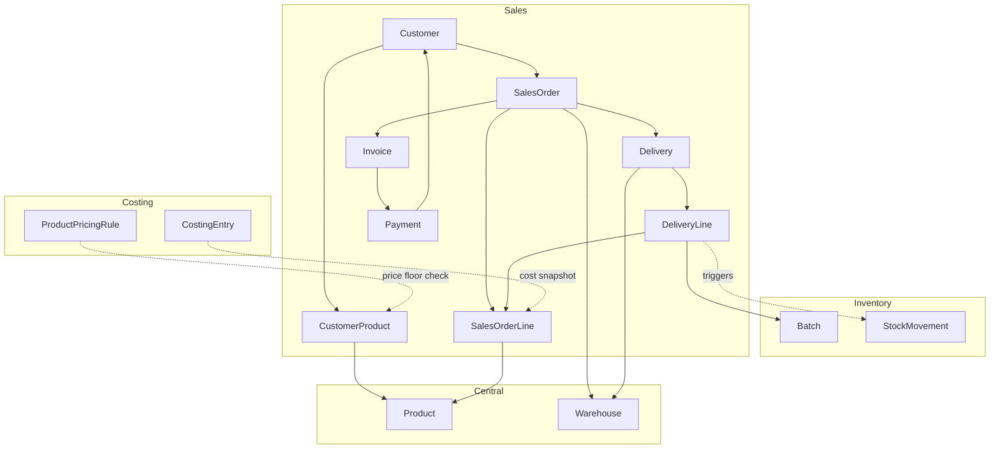
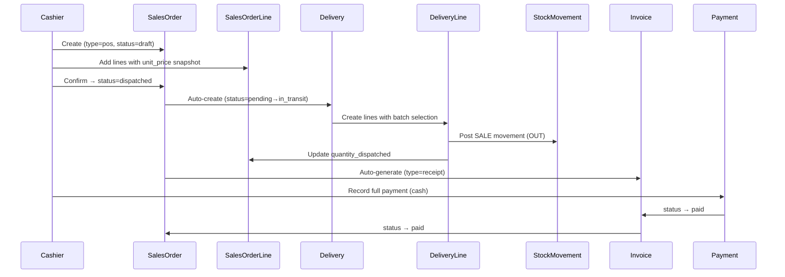
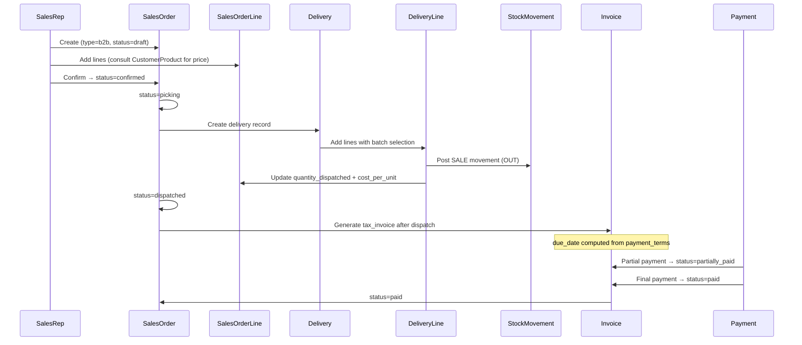
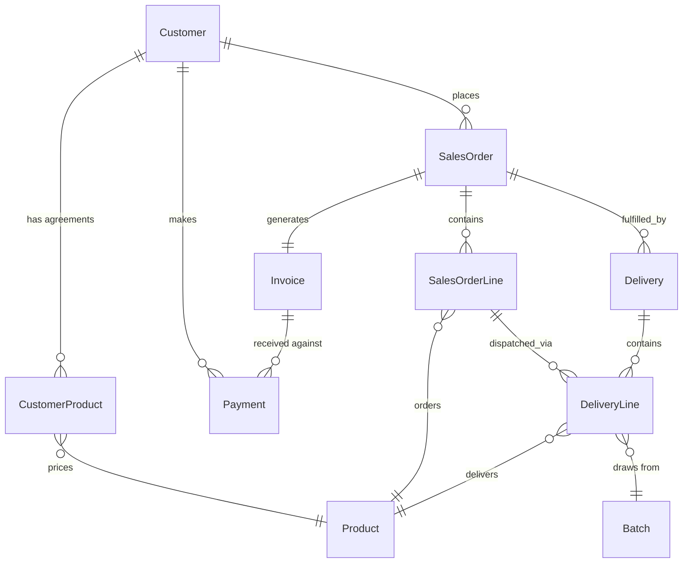

# Design Document: Sales Module Models

## Overview

The sales module handles the full lifecycle of goods leaving inventory and reaching customers — from price agreements and order creation through physical dispatch, invoicing, and payment collection. It supports two distinct workflows: a fast POS flow for retail/walk-in sales and a multi-step B2B flow for business customers with credit terms, partial deliveries, and formal invoicing.

This document covers the eight Django models that form the data layer of the sales module. Business logic (services, signals, validators) is out of scope here — the goal is to define the schema, relationships, and constraints that everything else will build on.

The module integrates with three existing apps: `inventory` (Stock, Batch, StockMovement), `costing` (CostingEntry, ProductPricingRule), and `central` (Product, Warehouse). It lives in a new `apps/sales` Django app.

---

## Architecture



---

## Sequence Diagrams

### POS Flow



### B2B Flow



---

## Components and Interfaces

### Customer

**Purpose**: Represents any buyer — walk-in retail or registered business. One permanent system record (`name="Cash Customer"`) serves all anonymous POS transactions.

**Key constraints**:
- `payment_terms` is only meaningful for `customer_type=business`
- `credit_limit` is only enforced for business customers
- `company_name` and `tax_number` are B2B-only fields

### CustomerProduct (Pricing Agreement)

**Purpose**: Records the negotiated unit price between the company and a specific business customer for a specific product. POS sales never consult this table.

**Key constraints**:
- `unit_price` must not fall below `ProductPricingRule.minimum_selling_price` — flagged at save time
- Only valid for `customer_type=business`
- Date range (`valid_from` / `valid_until`) controls when the agreement is active

### SalesOrder

**Purpose**: The header record for any sale. Owns the status lifecycle and aggregated financial totals.

**Key constraints**:
- `order_number` is auto-generated in the format `SO-XXXXX`
- POS orders: `draft → dispatched` (single step)
- B2B orders: `draft → confirmed → picking → dispatched → invoiced → paid`
- Cancellation blocked once status reaches `dispatched`
- `subtotal`, `tax_amount`, `total_amount` are denormalised aggregates updated when lines change

### SalesOrderLine

**Purpose**: One line per product on the order. Tracks both the ordered quantity and the dispatched quantity to support partial fulfilment.

**Key constraints**:
- `unit_price` is snapshotted at order confirmation and never changes after that
- `cost_per_unit` is populated at dispatch time from `CostingEntry`, not at order creation
- `cogs_total = quantity_dispatched × cost_per_unit`

### Delivery

**Purpose**: The physical dispatch record. A single `SalesOrder` can have multiple deliveries (B2B partial dispatch). POS always has exactly one.

**Key constraints**:
- `delivery_number` auto-generated as `DEL-XXXXX`
- Creating a `Delivery` is the trigger point for stock movement logic
- A `failed` delivery must be resolved before the order can close

### DeliveryLine

**Purpose**: The specific product, batch, and quantity within each delivery. This is the record that drives stock movement and batch traceability.

**Key constraints**:
- `batch` is mandatory — every sale must be traceable to a production batch
- Creating a `DeliveryLine` posts a `StockMovement` of type `SALE` (OUT)
- Updates `SalesOrderLine.quantity_dispatched`

### Invoice

**Purpose**: The financial document sent to the customer. Retail gets a receipt; B2B gets a tax invoice.

**Key constraints**:
- `invoice_number` auto-generated as `INV-XXXXX`
- `due_date` computed from `customer.payment_terms` at creation
- Once `status=issued`, amounts are immutable — cancel and reissue to correct
- POS invoice auto-generated on sale completion; B2B after dispatch

### Payment

**Purpose**: Records money received against an invoice. Supports partial payments for B2B.

**Key constraints**:
- Multiple payments can exist per invoice
- When `SUM(payments.amount) == invoice.total_amount` → invoice status becomes `paid`
- Overpayment must be flagged, not silently accepted
- POS payments are always full and immediate

---

## Data Models

### Customer

```python
class Customer(models.Model):
    CUSTOMER_TYPE_CHOICES = [
        ("retail", "Retail"),
        ("business", "Business"),
    ]
    PAYMENT_TERMS_CHOICES = [
        ("cash", "Cash"),
        ("net_30", "Net 30"),
        ("net_60", "Net 60"),
    ]

    id = models.UUIDField(primary_key=True, default=uuid.uuid4, editable=False)
    customer_type = models.CharField(max_length=20, choices=CUSTOMER_TYPE_CHOICES)
    name = models.CharField(max_length=255)
    phone = models.CharField(max_length=50, null=True, blank=True)
    email = models.EmailField(null=True, blank=True)
    address = models.TextField(null=True, blank=True)
    company_name = models.CharField(max_length=255, null=True, blank=True)
    payment_terms = models.CharField(max_length=20, choices=PAYMENT_TERMS_CHOICES, default="cash")
    credit_limit = models.DecimalField(max_digits=14, decimal_places=2, null=True, blank=True)
    tax_number = models.CharField(max_length=100, null=True, blank=True)
    is_active = models.BooleanField(default=True)
    created_at = models.DateTimeField(auto_now_add=True)
```

**Validation rules**:
- `name` is required
- `credit_limit` only enforced when `customer_type=business`
- `payment_terms` defaults to `cash`; only meaningful for business customers

---

### CustomerProduct

```python
class CustomerProduct(models.Model):
    id = models.UUIDField(primary_key=True, default=uuid.uuid4, editable=False)
    customer = models.ForeignKey(Customer, on_delete=models.CASCADE, related_name="product_agreements")
    product = models.ForeignKey(Product, on_delete=models.PROTECT, related_name="customer_agreements")
    unit_price = models.DecimalField(max_digits=14, decimal_places=2)
    min_order_quantity = models.DecimalField(max_digits=10, decimal_places=2, null=True, blank=True)
    is_active = models.BooleanField(default=True)
    valid_from = models.DateField()
    valid_until = models.DateField(null=True, blank=True)
    created_at = models.DateTimeField(auto_now_add=True)
```

**Validation rules**:
- `unit_price >= ProductPricingRule.minimum_selling_price` — flag if violated
- Only applicable to `customer_type=business`
- `unique_together = ("customer", "product")` for active agreements (enforced at service layer)

---

### SalesOrder

```python
class SalesOrder(models.Model):
    ORDER_TYPE_CHOICES = [
        ("pos", "POS"),
        ("b2b", "B2B"),
    ]
    STATUS_CHOICES = [
        ("draft", "Draft"),
        ("confirmed", "Confirmed"),
        ("picking", "Picking"),
        ("dispatched", "Dispatched"),
        ("invoiced", "Invoiced"),
        ("paid", "Paid"),
        ("cancelled", "Cancelled"),
    ]

    id = models.UUIDField(primary_key=True, default=uuid.uuid4, editable=False)
    order_number = models.CharField(max_length=20, unique=True, editable=False)
    customer = models.ForeignKey(Customer, on_delete=models.PROTECT, related_name="sales_orders")
    warehouse = models.ForeignKey(Warehouse, on_delete=models.PROTECT, related_name="sales_orders")
    order_type = models.CharField(max_length=10, choices=ORDER_TYPE_CHOICES)
    status = models.CharField(max_length=20, choices=STATUS_CHOICES, default="draft")
    order_date = models.DateTimeField()
    expected_delivery_date = models.DateField(null=True, blank=True)
    delivery_address = models.TextField(null=True, blank=True)
    notes = models.TextField(null=True, blank=True)
    subtotal = models.DecimalField(max_digits=14, decimal_places=2, default=0)
    tax_amount = models.DecimalField(max_digits=14, decimal_places=2, default=0)
    total_amount = models.DecimalField(max_digits=14, decimal_places=2, default=0)
    created_by = models.ForeignKey(settings.AUTH_USER_MODEL, on_delete=models.PROTECT, related_name="sales_orders_created")
    created_at = models.DateTimeField(auto_now_add=True)
    updated_at = models.DateTimeField(auto_now=True)
```

**Validation rules**:
- `order_number` auto-generated as `SO-XXXXX` (sequential, zero-padded)
- Cancellation blocked if `status in ["dispatched", "invoiced", "paid"]`
- POS valid status transitions: `draft → dispatched`
- B2B valid status transitions: `draft → confirmed → picking → dispatched → invoiced → paid`

---

### SalesOrderLine

```python
class SalesOrderLine(models.Model):
    id = models.UUIDField(primary_key=True, default=uuid.uuid4, editable=False)
    sales_order = models.ForeignKey(SalesOrder, on_delete=models.CASCADE, related_name="lines")
    product = models.ForeignKey(Product, on_delete=models.PROTECT, related_name="sales_order_lines")
    quantity = models.DecimalField(max_digits=10, decimal_places=2)
    unit_price = models.DecimalField(max_digits=14, decimal_places=2)
    subtotal = models.DecimalField(max_digits=14, decimal_places=2)
    quantity_dispatched = models.DecimalField(max_digits=10, decimal_places=2, default=0)
    cost_per_unit = models.DecimalField(max_digits=14, decimal_places=6, null=True, blank=True)
    cogs_total = models.DecimalField(max_digits=14, decimal_places=2, null=True, blank=True)
```

**Validation rules**:
- `subtotal = quantity × unit_price` (computed on save)
- `unit_price` locked once parent `SalesOrder.status` moves past `draft`
- `cost_per_unit` populated at dispatch time only
- `quantity_dispatched <= quantity` always

---

### Delivery

```python
class Delivery(models.Model):
    STATUS_CHOICES = [
        ("pending", "Pending"),
        ("in_transit", "In Transit"),
        ("delivered", "Delivered"),
        ("failed", "Failed"),
    ]

    id = models.UUIDField(primary_key=True, default=uuid.uuid4, editable=False)
    sales_order = models.ForeignKey(SalesOrder, on_delete=models.PROTECT, related_name="deliveries")
    warehouse = models.ForeignKey(Warehouse, on_delete=models.PROTECT, related_name="deliveries")
    delivery_number = models.CharField(max_length=20, unique=True, editable=False)
    status = models.CharField(max_length=20, choices=STATUS_CHOICES, default="pending")
    dispatched_at = models.DateTimeField()
    delivered_at = models.DateTimeField(null=True, blank=True)
    driver_name = models.CharField(max_length=255, null=True, blank=True)
    vehicle = models.CharField(max_length=100, null=True, blank=True)
    notes = models.TextField(null=True, blank=True)
    created_by = models.ForeignKey(settings.AUTH_USER_MODEL, on_delete=models.PROTECT, related_name="deliveries_created")
```

**Validation rules**:
- `delivery_number` auto-generated as `DEL-XXXXX`
- A `failed` delivery blocks order closure (enforced at service layer)
- POS: one delivery auto-created and immediately dispatched

---

### DeliveryLine

```python
class DeliveryLine(models.Model):
    id = models.UUIDField(primary_key=True, default=uuid.uuid4, editable=False)
    delivery = models.ForeignKey(Delivery, on_delete=models.CASCADE, related_name="lines")
    sales_order_line = models.ForeignKey(SalesOrderLine, on_delete=models.PROTECT, related_name="delivery_lines")
    product = models.ForeignKey(Product, on_delete=models.PROTECT, related_name="delivery_lines")
    batch = models.ForeignKey(Batch, on_delete=models.PROTECT, related_name="delivery_lines")
    quantity_delivered = models.DecimalField(max_digits=10, decimal_places=2)
```

**Validation rules**:
- `batch` is mandatory — no anonymous stock movements
- `product` is denormalised from `sales_order_line.product` for query convenience
- `quantity_delivered` must not exceed remaining undelivered quantity on the `SalesOrderLine`
- On creation: posts `StockMovement` (type=SALE, OUT) and increments `SalesOrderLine.quantity_dispatched`

---

### Invoice

```python
class Invoice(models.Model):
    INVOICE_TYPE_CHOICES = [
        ("receipt", "Receipt"),
        ("tax_invoice", "Tax Invoice"),
    ]
    STATUS_CHOICES = [
        ("draft", "Draft"),
        ("issued", "Issued"),
        ("partially_paid", "Partially Paid"),
        ("paid", "Paid"),
        ("overdue", "Overdue"),
        ("cancelled", "Cancelled"),
    ]

    id = models.UUIDField(primary_key=True, default=uuid.uuid4, editable=False)
    sales_order = models.OneToOneField(SalesOrder, on_delete=models.PROTECT, related_name="invoice")
    invoice_number = models.CharField(max_length=20, unique=True, editable=False)
    invoice_type = models.CharField(max_length=20, choices=INVOICE_TYPE_CHOICES)
    issued_date = models.DateField()
    due_date = models.DateField()
    subtotal = models.DecimalField(max_digits=14, decimal_places=2)
    tax_amount = models.DecimalField(max_digits=14, decimal_places=2)
    total_amount = models.DecimalField(max_digits=14, decimal_places=2)
    status = models.CharField(max_length=20, choices=STATUS_CHOICES, default="draft")
    created_by = models.ForeignKey(settings.AUTH_USER_MODEL, on_delete=models.PROTECT, related_name="invoices_created")
    created_at = models.DateTimeField(auto_now_add=True)
```

**Validation rules**:
- `invoice_number` auto-generated as `INV-XXXXX`
- `due_date` computed from `sales_order.customer.payment_terms` at creation:
  - `cash` → same as `issued_date`
  - `net_30` → `issued_date + 30 days`
  - `net_60` → `issued_date + 60 days`
- Once `status=issued`, `subtotal`, `tax_amount`, `total_amount` are immutable
- POS → `invoice_type=receipt`; B2B → `invoice_type=tax_invoice`

---

### Payment

```python
class Payment(models.Model):
    PAYMENT_METHOD_CHOICES = [
        ("cash", "Cash"),
        ("bank_transfer", "Bank Transfer"),
        ("mobile_money", "Mobile Money"),
        ("cheque", "Cheque"),
    ]

    id = models.UUIDField(primary_key=True, default=uuid.uuid4, editable=False)
    invoice = models.ForeignKey(Invoice, on_delete=models.PROTECT, related_name="payments")
    customer = models.ForeignKey(Customer, on_delete=models.PROTECT, related_name="payments")
    amount = models.DecimalField(max_digits=14, decimal_places=2)
    payment_method = models.CharField(max_length=20, choices=PAYMENT_METHOD_CHOICES)
    payment_date = models.DateTimeField()
    reference = models.CharField(max_length=255, null=True, blank=True)
    received_by = models.ForeignKey(settings.AUTH_USER_MODEL, on_delete=models.PROTECT, related_name="payments_received")
    notes = models.TextField(null=True, blank=True)
```

**Validation rules**:
- `amount > 0`
- `SUM(payments) > invoice.total_amount` → flag as overpayment, do not silently accept
- `SUM(payments) == invoice.total_amount` → set `invoice.status = paid`
- `0 < SUM(payments) < invoice.total_amount` → set `invoice.status = partially_paid`
- `customer` is denormalised from `invoice.sales_order.customer`

---

## Cross-Model Relationships Summary



---

## Error Handling

### Cancellation After Dispatch
**Condition**: Attempt to cancel a `SalesOrder` with `status=dispatched` or later  
**Response**: Reject with validation error — stock has already moved  
**Recovery**: A separate returns/reversal process is required (out of scope for this spec)

### Price Below Minimum
**Condition**: `CustomerProduct.unit_price < ProductPricingRule.minimum_selling_price`  
**Response**: Flag the record (warning, not hard block) — management may override  
**Recovery**: Update `unit_price` to meet the floor, or get explicit approval

### Overpayment
**Condition**: `SUM(payments) > invoice.total_amount`  
**Response**: Reject the payment with a validation error  
**Recovery**: Adjust `amount` to the remaining balance, or handle as credit note (future scope)

### Failed Delivery
**Condition**: `Delivery.status=failed`  
**Response**: Block order from moving to `invoiced` or `paid`  
**Recovery**: Resolve the delivery (reattempt or mark returned) before closing the order

### Partial Dispatch — Order Closure
**Condition**: `SalesOrderLine.quantity_dispatched < quantity` when attempting to close  
**Response**: Warn that not all lines are fully dispatched  
**Recovery**: Create additional deliveries or accept partial fulfilment explicitly

---

## Testing Strategy

### Unit Testing Approach
- Each model's `save()` / `clean()` logic tested in isolation
- Auto-generated reference numbers (`SO-`, `DEL-`, `INV-`) tested for uniqueness and format
- Status transition guards tested for both POS and B2B paths
- `due_date` computation tested for all three `payment_terms` values

### Property-Based Testing Approach
**Library**: `hypothesis` with `pytest-django`

Key properties to test:
- For any `Payment` amount, `SUM(payments) <= invoice.total_amount` must hold (or overpayment is flagged)
- `SalesOrderLine.subtotal == quantity × unit_price` always holds
- `SalesOrderLine.quantity_dispatched <= quantity` always holds
- `DeliveryLine.quantity_delivered` summed across all deliveries never exceeds `SalesOrderLine.quantity`

### Integration Testing Approach
- Full POS flow: create order → confirm → auto-delivery → auto-invoice → payment → verify all statuses
- Full B2B flow: create order → confirm → picking → delivery → invoice → partial payment → final payment
- Stock movement verification: after `DeliveryLine` creation, `Batch.quantity` decreases correctly
- COGS snapshot: `SalesOrderLine.cost_per_unit` matches `CostingEntry.cost_per_unit` at dispatch time

---

## Dependencies

| Dependency | Source | Usage |
|---|---|---|
| `Product` | `central.models` | FK on `CustomerProduct`, `SalesOrderLine`, `DeliveryLine` |
| `Warehouse` | `central.models` | FK on `SalesOrder`, `Delivery` |
| `Batch` | `apps.inventory.models` | FK on `DeliveryLine` — batch traceability |
| `StockMovement` | `apps.inventory.models` | Created by `DeliveryLine` save signal |
| `CostingEntry` | `apps.costing.models` | Source of `cost_per_unit` snapshot at dispatch |
| `ProductPricingRule` | `apps.costing.models` | Price floor check for `CustomerProduct` |
| `settings.AUTH_USER_MODEL` | `apps.accounts.models` | `created_by` / `received_by` FKs |

---

## Correctness Properties

*A property is a characteristic or behavior that should hold true across all valid executions of a system — essentially, a formal statement about what the system should do. Properties serve as the bridge between human-readable specifications and machine-verifiable correctness guarantees.*

### Property 1: SalesOrderLine subtotal invariant

*For any* SalesOrderLine with any `quantity` and `unit_price`, the stored `subtotal` must equal `quantity × unit_price`.

**Validates: Requirements 4.2**

---

### Property 2: quantity_dispatched never exceeds quantity

*For any* SalesOrderLine, after any number of DeliveryLine creations, `quantity_dispatched` must never exceed `quantity`.

**Validates: Requirements 4.4, 6.5**

---

### Property 3: DeliveryLine quantity_delivered respects remaining balance

*For any* SalesOrderLine and any set of DeliveryLines against it, the sum of all `quantity_delivered` values must never exceed `SalesOrderLine.quantity`.

**Validates: Requirements 6.5**

---

### Property 4: Payment sum drives invoice status correctly

*For any* Invoice and any sequence of Payment records against it, the invoice status must be `partially_paid` when `0 < SUM(payments.amount) < total_amount`, `paid` when `SUM(payments.amount) == total_amount`, and any payment that would cause `SUM > total_amount` must be rejected.

**Validates: Requirements 8.3, 8.4, 8.5**

---

### Property 5: Reference number format and uniqueness

*For any* set of SalesOrder, Delivery, or Invoice records, every auto-generated reference number must match its respective format (`SO-XXXXX`, `DEL-XXXXX`, `INV-XXXXX`) and be unique within its model.

**Validates: Requirements 3.2, 5.2, 7.2, 9.1, 9.2, 9.3**

---

### Property 6: Invoice due_date computation

*For any* Invoice, the `due_date` must equal `issued_date` for `cash` terms, `issued_date + 30 days` for `net_30`, and `issued_date + 60 days` for `net_60`.

**Validates: Requirements 7.3**

---

### Property 7: Cancellation blocked after dispatch

*For any* SalesOrder with `status` in `{dispatched, invoiced, paid}`, attempting to set `status=cancelled` must be rejected.

**Validates: Requirements 3.5**

---

### Property 8: unit_price immutability after draft

*For any* SalesOrderLine whose parent SalesOrder has moved past `draft` status, any attempt to change `unit_price` must be rejected, leaving the original value unchanged.

**Validates: Requirements 4.3**

---

### Property 9: CustomerProduct price floor flag

*For any* CustomerProduct where `unit_price < ProductPricingRule.minimum_selling_price` for the associated product, the model must flag the violation.

**Validates: Requirements 2.2**
